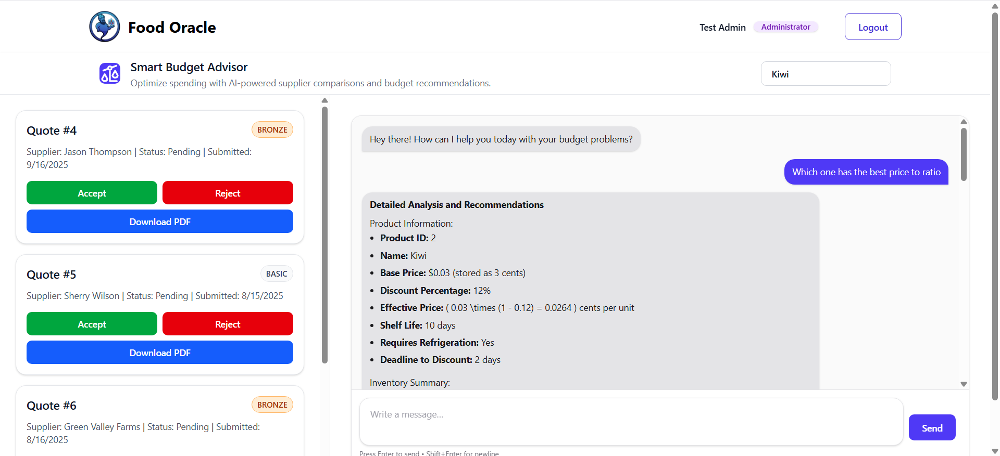
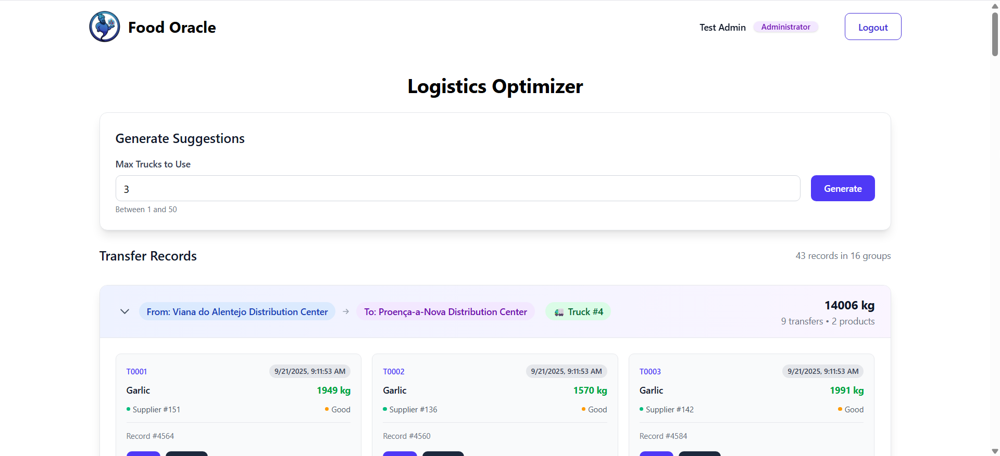
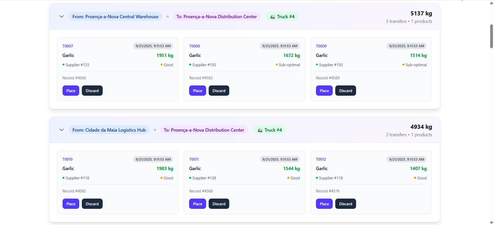
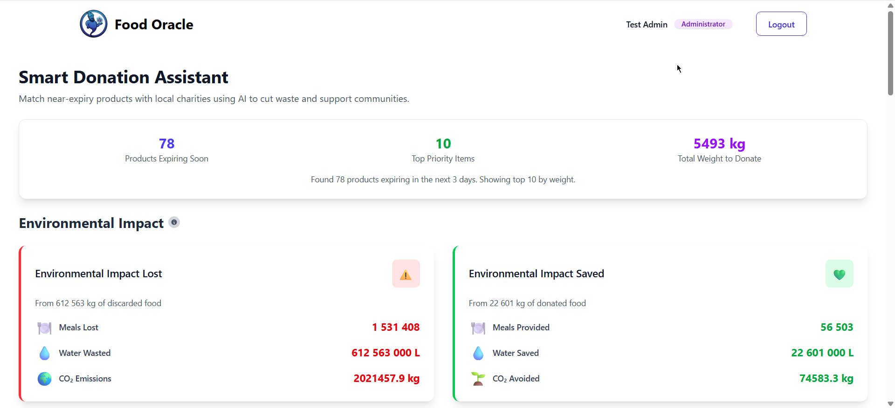
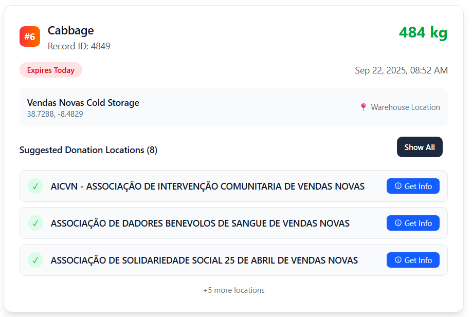
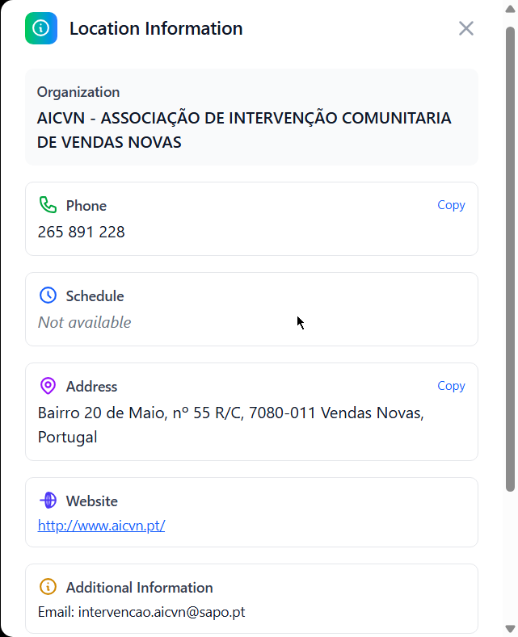
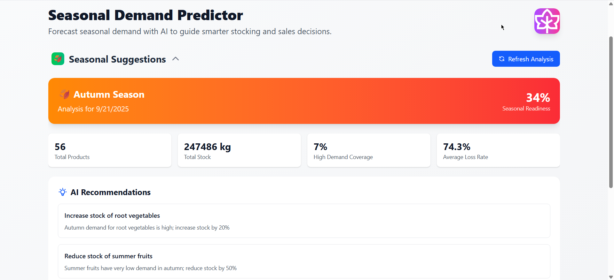
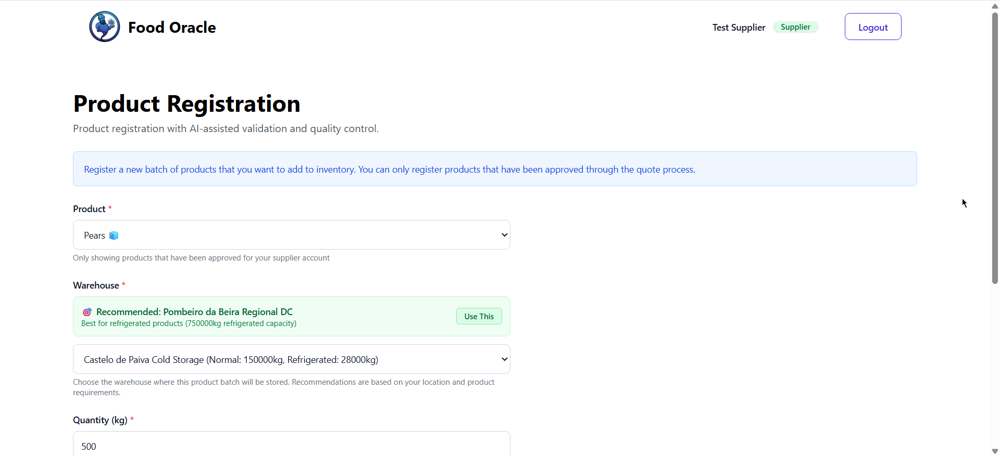
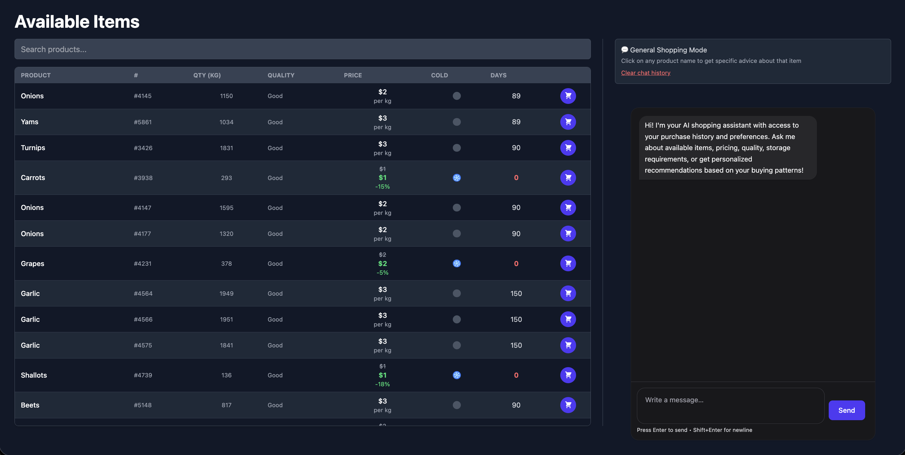

# Food Oracle | Hackstreet Boys

## Demo

Here is a link for viewing our platform working: [Check Video](https://www.youtube.com/watch?v=t-AaqvO4_hU)

## Problem

Food factories today face a massive challenge: balancing production, storage, and demand. And the result is shocking: in Portugal alone, 1.9 million tons of food are wasted every year.
With this much loss, there’s also a lot of money to be saved — and a lot of people to be helped. This happens due to Limited AI insights, Poor supplier management, Inefficient stock transfers 
and Low personalization.
So we propose Food Oracle, an AI-Powered platform built for predicting profit, and preventing waste.

## Our solution
Our platform contains various AI features that can help everyone:

### Smart Budget Advisor

This chatbot knows everything about the product, the current inventory, the supplier history and his classification. Given that when he reads the quotations PDFs he can give the best advices.

### Logistics Optimizer

This element forecasts the demand for each products in calculated zones and them redistributes them for the warehouses that need the most. Making products available where they are actually needed.

As we can see Proença-a-Nova Distribution Center really needs garlic :D

### Smart Donation Assistant

When inevitable waste happens it's where food oracle shines. We turn waste into worth. We find near expiry products and suggest near NGO's to donate it.

### Seasonal Demand Predictor

We give seasonal forecasts and suggestions

### Automatic Product Quality Checker

When a supplier registers a product AI automatically suggests the best suitable warehouse and detects the product quality.

### Client Shopping Advisor

An AI takes as context the buyer history, the items already in the cart, and the available items and suggestions the best buys

(We also have dark mode ;D )

## How to test it

If you want you can just try it at http://food-oracle.joao-oliveira.org

Login with:

| E-mail | Password |
|---------|-------------|
| `admin@test.com` | `1234` |
| `supplier@test.com` | `1234` |
| `buyer@test.com` | `1234` |
| `driver@test.com` | `1234` |

If you want to build it locally you have a comprehensive makefile on the root directory with the proper commands. 
To make it work you can just do `make all` to build everything and `make db-populate` to add data to database. You also have to add your AWS token and OpenAI token on the .env.
If you're on Windows try running the docker compose commands on the makefile or consider changing ☺

Heres the command list and the relevant links and credentials

| Command | Description |
|---------|-------------|
| `make all` | Build and start all services |
| `make down` | Stop all running services |
| `make clean` | Stop services and remove volumes (WARNING: deletes data) |
| `make clear-cache` | Clear all Docker cache (images, build cache, containers) |
| `make logs` | Show logs for all services |
| `make backend` | Start only backend service |
| `make frontend` | Start only frontend service |
| `make database` | Start only database service |
| `make minio` | Start only minio service |
| `make db-populate` | Populate database with sample data |
| `make db-reset` | Reset database (drop and recreate) |
| `make compile-backend` | Compile backend Python code |

## Services & Access Points

### MinIO (Object Storage)
- **URL**: http://localhost:9001/
- **Username**: `minioadmin`
- **Password**: `minioadmin`

### PostgreSQL Database
- **Host**: `localhost` (or `127.0.0.1`)
- **Port**: `5432`
- **Database**: `supply_chain_db`
- **Username**: `supply_chain_user`
- **Password**: `supply_chain_password`

### API Backend
- **Documentation**: http://34.235.125.104:8000/docs
- **Base URL**: http://34.235.125.104:8000

### Frontend Application
- **Website**: http://localhost:3000