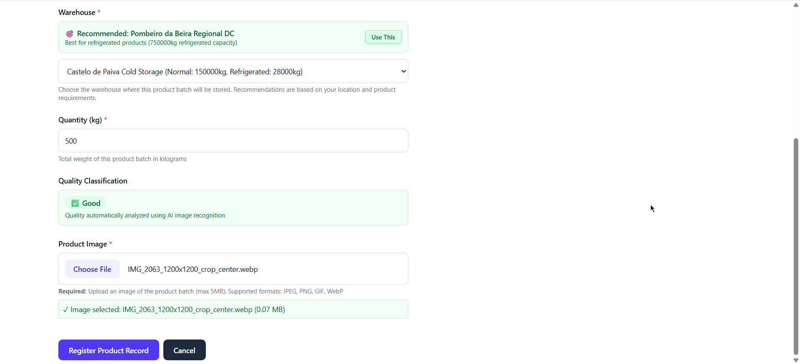

# 🍎 Food Oracle

[](https://fastapi.tiangolo.com/)
[](https://reactjs.org/)
[](https://www.postgresql.org/)
[](https://www.docker.com/)
[](https://aws.amazon.com/)

> **An AI-Powered Supply Chain Management Platform** that predicts demand, prevents waste, and optimizes logistics for food factories and distributors.

## 🎬 Demo

**Watch our platform in action:** [📺 Demo Video](https://www.youtube.com/watch?v=t-AaqvO4_hU)

**Live Demo:** [🌐 Try it now](http://food-oracle.joao-oliveira.org)

## 🚨 The Problem

Food waste is a global crisis with devastating consequences:

- **🇵🇹 Portugal alone wastes 1.9 million tons of food annually**
- **💰 Billions in lost revenue** due to inefficient supply chain management
- **👥 Millions of people** could be fed with wasted food
- **🌍 Environmental impact** from unnecessary production and disposal

### Root Causes:
- ❌ **Limited AI insights** for demand forecasting
- ❌ **Poor supplier management** and communication
- ❌ **Inefficient stock transfers** between warehouses
- ❌ **Low personalization** in recommendations
- ❌ **Manual processes** prone to human error

## 💡 Our Solution

**Food Oracle** is a comprehensive AI-powered platform that transforms supply chain management through intelligent automation, predictive analytics, and waste reduction strategies.

## ✨ Key Features

### 🤖 Smart Budget Advisor
**AI-powered procurement optimization**

- **📊 Intelligent Analysis**: Analyzes product inventory, supplier history, and market trends
- **📄 PDF Processing**: Automatically reads and processes quotation PDFs using AWS Bedrock
- **💰 Cost Optimization**: Provides data-driven recommendations for optimal purchasing decisions
- **📈 Supplier Scoring**: Evaluates suppliers based on performance metrics and reliability


### 🚛 Logistics Optimizer
**Demand forecasting and inventory redistribution**

- **🔮 Predictive Analytics**: Uses machine learning to forecast demand across different zones
- **📍 Geographic Intelligence**: Optimizes distribution based on location-specific demand patterns
- **⚖️ Load Balancing**: Automatically redistributes inventory to warehouses with highest demand
- **📊 Real-time Insights**: Provides visual analytics on supply chain efficiency


*Proença-a-Nova Distribution Center really needs garlic! 🧄*

### 🎁 Smart Donation Assistant
**Transform waste into social impact**

- **⏰ Expiry Monitoring**: Automatically identifies products nearing expiration
- **🏢 NGO Matching**: Connects with nearby charitable organizations for donations
- **📱 Easy Coordination**: Streamlined process for scheduling and managing donations
- **📊 Impact Tracking**: Measures social and environmental impact of donations


### 📅 Seasonal Demand Predictor
**Weather and season-based forecasting**

- **🌤️ Weather Integration**: Incorporates weather patterns into demand predictions
- **📈 Trend Analysis**: Identifies seasonal patterns and market trends
- **🎯 Targeted Recommendations**: Suggests optimal inventory levels for upcoming seasons
- **📊 Visual Analytics**: Interactive charts showing demand patterns over time


### 🔍 Automatic Product Quality Checker
**AI-powered quality assessment and warehouse optimization**

- **🔬 Quality Detection**: Uses computer vision to assess product quality automatically
- **🏭 Warehouse Matching**: Suggests optimal warehouse locations based on product characteristics
- **📋 Automated Processing**: Streamlines product registration and classification
- **⚡ Real-time Validation**: Instant quality assessment during product intake




### 🛒 Client Shopping Advisor
**Personalized shopping experience**

- **🧠 Smart Recommendations**: AI analyzes buyer history and current cart contents
- **💡 Personalized Suggestions**: Provides tailored product recommendations
- **🛍️ Cart Optimization**: Suggests complementary products and deals


## 🏗️ Complete Supply Chain Platform

Beyond AI features, Food Oracle provides a full-featured supply chain management system:

- **🚛 Fleet Management**: Realistic truck capacity and routing optimization
- **🏪 Warehouse Operations**: Storage limits, inventory tracking, and space optimization
- **⏰ Product Lifecycle**: Automatic expiration tracking and management
- **👥 Multi-role Support**: Separate interfaces for admins, suppliers, buyers, and drivers
- **📊 Analytics Dashboard**: Comprehensive reporting and business intelligence

## 🛠️ Technology Stack

### Backend
- **🐍 Python 3.10** - Core programming language
- **⚡ FastAPI** - Modern, fast web framework for building APIs
- **🗄️ PostgreSQL + PostGIS** - Relational database with geospatial extensions
- **🔍 SQLAlchemy** - ORM for database operations
- **🐳 Docker** - Containerization platform
- **☁️ AWS Bedrock** - AI/ML services for document processing
- **🤖 OpenAI API** - AI-powered recommendations and analysis
- **📊 scikit-learn** - Machine learning algorithms
- **📈 Prophet** - Time series forecasting
- **🗺️ GeoPandas** - Geospatial data processing
- **📦 MinIO** - Object storage for files and documents

### Frontend
- **⚛️ React 19** - Modern UI library
- **🛣️ React Router v7** - Client-side routing
- **🎨 Tailwind CSS** - Utility-first CSS framework
- **📱 TypeScript** - Type-safe JavaScript
- **⚡ Vite** - Fast build tool and dev server

### Infrastructure
- **🐳 Docker Compose** - Multi-container orchestration
- **🗄️ PostgreSQL** - Primary database
- **📦 MinIO** - Object storage
- **🌐 Nginx** - Reverse proxy and load balancer

## 🚀 Quick Start

### 🌐 Live Demo
**Try the platform instantly:** [http://food-oracle.joao-oliveira.org](http://food-oracle.joao-oliveira.org)

#### Demo Accounts
| Role | Email | Password | Description |
|------|-------|----------|-------------|
| **Admin** | `admin@test.com` | `1234` | Full system access and management |
| **Supplier** | `supplier@test.com` | `1234` | Product registration and management |
| **Buyer** | `buyer@test.com` | `1234` | Shopping and procurement |
| **Driver** | `driver@test.com` | `1234` | Logistics and delivery management |

### 🏠 Local Development

#### Prerequisites
- **Docker & Docker Compose** installed
- **Git** for cloning the repository
- **AWS Account** (for AI features)
- **OpenAI API Key** (for AI recommendations)

#### Installation Steps

1. **Clone the repository**
   ```bash
   git clone https://github.com/your-username/food-oracle.git
   cd food-oracle
   ```

2. **Set up environment variables**
   ```bash
   cp env.example .env
   # Edit .env with your AWS and OpenAI credentials
   ```

3. **Build and start all services**
   ```bash
   make all
   ```

4. **Populate the database with sample data**
   ```bash
   make db-populate
   ```

5. **Access the application**
   - **Frontend**: http://localhost:3000
   - **API Docs**: http://localhost:8000/docs
   - **Database**: localhost:5432
   - **MinIO Console**: http://localhost:9001

> **💡 Windows Users**: If you encounter issues with the Makefile, you can run the Docker Compose commands directly or use WSL2.

### 📋 Available Commands

| Command | Description | Use Case |
|---------|-------------|----------|
| `make all` | Build and start all services | Initial setup |
| `make down` | Stop all running services | Shutdown |
| `make clean` | Stop services and remove volumes | **⚠️ WARNING: Deletes all data** |
| `make clear-cache` | Clear all Docker cache | Troubleshooting |
| `make logs` | Show logs for all services | Debugging |
| `make backend` | Start only backend service | Backend development |
| `make frontend` | Start only frontend service | Frontend development |
| `make database` | Start only database service | Database work |
| `make minio` | Start only MinIO service | File storage testing |
| `make db-populate` | Populate database with sample data | Initial data setup |
| `make db-reset` | Reset database (drop and recreate) | Fresh start |
| `make compile-backend` | Compile backend Python code | Backend compilation |

### 🔧 Development Workflow

1. **Start development environment**
   ```bash
   make all
   make db-populate
   ```

2. **View logs for debugging**
   ```bash
   make logs
   ```

3. **Reset database if needed**
   ```bash
   make db-reset
   make db-populate
   ```

4. **Stop everything**
   ```bash
   make down
   ```

## 🏗️ System Architecture

## How to test it

If you want you can just try it at http://food-oracle.joao-oliveira.org

Login with:

| E-mail | Password |
|---------|-------------|
| `admin@test.com` | `1234` |
| `supplier@test.com` | `1234` |
| `buyer@test.com` | `1234` |
| `driver@test.com` | `1234` |

If you want to build it locally you have a comprehensive makefile on the root directory with the proper commands. 
To make it work you can just do `make all` to build everything and `make db-populate` to add data to database. You also have to add your AWS token and OpenAI token on the .env.
If you're on Windows try running the docker compose commands on the makefile or consider changing ☺

Heres the command list and the relevant links and credentials

## 🔗 Services & Access Points

### 🌐 Frontend Application
- **URL**: http://localhost:3000
- **Description**: React-based user interface
- **Features**: Multi-role dashboard, real-time updates, responsive design

### ⚡ API Backend
- **Documentation**: http://localhost:8000/docs
- **Base URL**: http://localhost:8000
- **Description**: FastAPI REST API with automatic documentation
- **Features**: Authentication, CRUD operations, AI integration

### 🗄️ PostgreSQL Database
- **Host**: `localhost` (or `127.0.0.1`)
- **Port**: `5432`
- **Database**: `supply_chain_db`
- **Username**: `supply_chain_user`
- **Password**: `supply_chain_password`
- **Features**: PostGIS for geospatial data, ACID compliance

### 📦 MinIO Object Storage
- **Console URL**: http://localhost:9001/
- **API URL**: http://localhost:9000/
- **Username**: `minioadmin`
- **Password**: `minioadmin`
- **Features**: S3-compatible storage for files and documents

## 🗺️ Roadmap

- [ ] **📊 AI-Generated Reports**: Automated weekly/monthly business intelligence reports
- [ ] **🌐 News Integration**: Web-scraped news integration for demand prediction
- [ ] **💬 Natural Language Query**: Chatbot for database queries and insights
- [ ] **🔍 Predictive Maintenance**: AI-powered equipment maintenance scheduling
- [ ] **🎯 IoT Integration**: Real-time sensor data for quality monitoring


*Made with ❤️ by the Hackstreet Boys*
